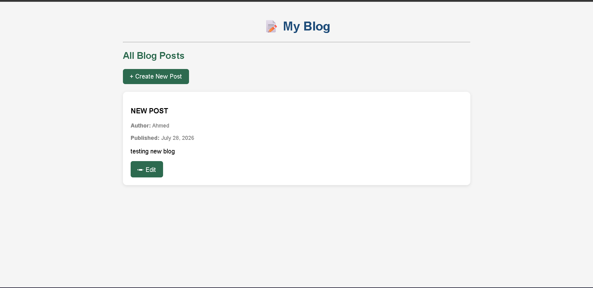
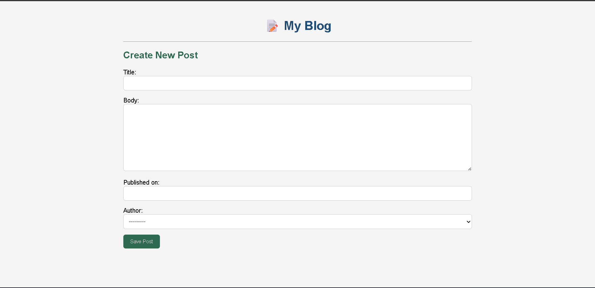
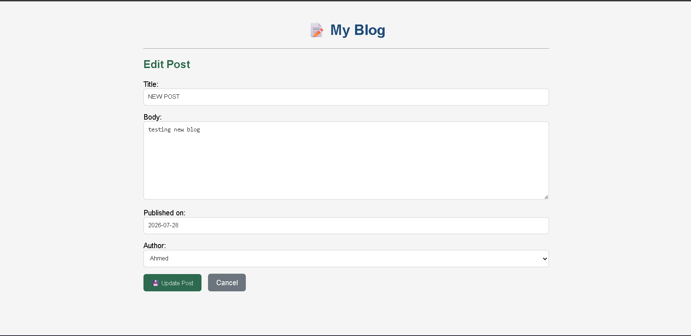
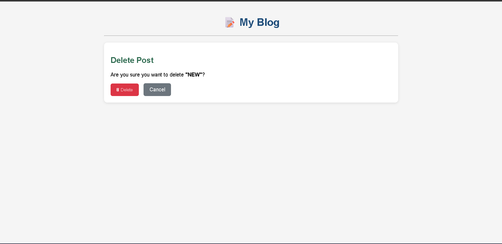

# 📝 Django CRUD Blog


---

## 📖 Description

A **CRUD Blog Application** built with **Django** — created as a learning project to understand Django's core concepts including **templates**, **static files**, **ModelForms**, **function-based views**, **URL routing**, and **database models**.

This project demonstrates a complete **Create, Read, Update, Delete** workflow for blog posts, with a clean and responsive user interface powered by custom CSS.

---

## ✨ Features

- ✅ **Display all blog posts** — View all posts on the homepage with title, author, publication date, and a truncated body preview.
- ✅ **Create new posts** — Use a Django ModelForm to submit new blog posts with title, body, publication date, and author selection.
- ✅ **Edit existing posts** — Update any post's content through a pre-filled edit form.
- ✅ **Delete existing posts** — Remove posts with a confirmation page. Deletion is performed via a **POST request** for safe, intentional removal.
- ✅ **Author information** — Each post is linked to an Author via a **ForeignKey** relationship.
- ✅ **Template inheritance** — Reusable `base.html` layout extended by all child templates.
- ✅ **Static CSS styling** — Custom `style.css` provides a clean, responsive design.
- ✅ **Template filters** — Date formatting (`date:"F d, Y"`) and word truncation (`truncatewords:25`) applied to post content.
- ✅ **CSRF protection** — All forms include `` for security.
- ✅ **Redirect after submission** — Successful form submissions redirect to the post list page.
- ✅ **Responsive UI** — Mobile-friendly layout with max-width container and clean card-based design.
- ✅ **SQLite database** — Lightweight, file-based database for development.
- ✅ **Django Admin** — Manage Authors and Posts through the built-in admin interface.

---

## 🛠 Technologies Used

| Technology | Purpose |
|------------|---------|
| **Python** | Backend programming language |
| **Django 6.0** | Web framework |
| **HTML5** | Template structure |
| **CSS3** | Styling and layout |
| **SQLite** | Database |

---

## 📁 Project Structure

```
myLab/
│
├── blog/                          # Main blog application
│   ├── migrations/                 # Database migrations
│   │   ├── __init__.py
│   │   └── 0001_initial.py
│   │
│   ├── static/
│   │   └── blog/
│   │       └── style.css          # Custom CSS styles
│   │
│   ├── templates/
│   │   └── blog/
│   │       ├── base.html          # Base template (inherited by all pages)
│   │       ├── post_list.html      # Homepage — lists all posts
│   │       ├── post_form.html      # Create new post form
│   │       ├── edit_post.html      # Edit existing post form
│   │       └── delete_post.html    # Delete post confirmation page
│   │
│   ├── __init__.py
│   ├── admin.py                   # Django Admin registration
│   ├── apps.py                    # App configuration
│   ├── forms.py                   # ModelForm for Post model
│   ├── models.py                  # Author and Post models
│   ├── tests.py                   # Test stubs
│   ├── urls.py                    # App-level URL routes
│   └── views.py                   # View functions
│
├── myLab/                         # Project configuration
│   ├── __init__.py
│   ├── asgi.py                    # ASGI config
│   ├── settings.py                # Django settings
│   ├── urls.py                    # Root URL configuration
│   └── wsgi.py                    # WSGI config
│
├── db.sqlite3                     # SQLite database file
├── manage.py                      # Django management script
├── requirements.txt               # Python dependencies
└── README.md                      # Project documentation
```

---

## 🧩 Models

### Author

| Field | Type | Description |
|-------|------|-------------|
| `name` | `CharField(max_length=100)` | Author's display name |

### Post

| Field | Type | Description |
|-------|------|-------------|
| `title` | `CharField(max_length=250)` | Post title |
| `body` | `TextField()` | Full content of the post |
| `published_on` | `DateField()` | Date the post was published |
| `author` | `ForeignKey(Author, on_delete=models.CASCADE)` | Links to the Author model |

### Relationship

- **Author** has a **one-to-many** relationship with **Post** — one author can write multiple posts.
- Deleting an Author will **cascade-delete** all their associated posts (`on_delete=models.CASCADE`).

---

## 🌐 Implemented Pages

### 🏠 Home Page (`/`)

- Lists **all blog posts** in reverse chronological order.
- Each post card displays:
  - **Title**
  - **Author name** (via `post.author.name`)
  - **Published date** (formatted with `|date:"F d, Y"`)
  - **Body preview** (truncated to 25 words with `|truncatewords:25`)
- Includes a **"Create New Post"** button to navigate to the creation form.
- Each post has an **"Edit"** button to navigate to the edit form.
- Extends `base.html` for consistent layout.

### ➕ Create Post (`/create/`)

- Displays a **ModelForm** for creating a new post.
- Fields: Title, Body, Published On, Author (dropdown).
- **GET request** — renders an empty form.
- **POST request** — validates and saves the form, then redirects to the home page.
- Includes **CSRF token** for security.
- Extends `base.html`.

### ✏️ Edit Post (`/edit/<id>/`)

- Pre-populates the form with the **existing post data** using `instance=post`.
- **GET request** — renders the form with current values.
- **POST request** — validates and updates the post, then redirects to the home page.
- Includes a **Cancel** button to return to the home page.
- Includes **CSRF token** for security.
- Extends `base.html`.

### 🗑 Delete Post (`/delete/<id>/`)

- Displays a **confirmation page** asking the user to confirm the deletion.
- Shows the **post title** so the user knows exactly what they are deleting.
- **GET request** — renders the confirmation form.
- **POST request** — deletes the post and redirects to the home page.
- Deletion is **only performed after submitting the confirmation form**, preventing accidental removals.
- Includes a **Cancel** button to return to the home page.
- Includes **CSRF token** for security.
- Extends `base.html`.

### 🔧 Django Admin (`/admin/`)

- Manage **Authors** (add, edit, delete).
- Manage **Posts** (add, edit, delete).
- Requires a **superuser** account to access.

---

## 🧭 URL Routes

| Route | View Name | Description |
|-------|-----------|-------------|
| `/` | `post_list` | Home page — displays all blog posts |
| `/create/` | `create_post` | Form page — create a new blog post |
| `/edit/<int:post_id>/` | `edit_post` | Form page — edit an existing blog post |
| `/delete/<int:post_id>/` | `delete_post` | Confirmation page — delete a blog post |
| `/admin/` | `admin:index` | Django Admin interface |

---

## 🚀 How to Run

### 1️⃣ Clone the repository

```bash
git clone https://github.com/yourusername/your-repo-name.git
cd your-repo-name
```

### 2️⃣ Create a virtual environment

```bash
python -m venv venv
```

### 3️⃣ Activate the virtual environment

**Windows:**
```bash
venv\Scripts\activate
```

**macOS / Linux:**
```bash
source venv/bin/activate
```

### 4️⃣ Install dependencies

```bash
pip install -r requirements.txt
```

### 5️⃣ Run database migrations

```bash
python manage.py migrate
```

### 6️⃣ Create a superuser (for Django Admin)

```bash
python manage.py createsuperuser
```
Follow the prompts to set a username, email, and password.

### 7️⃣ Run the development server

```bash
python manage.py runserver
```

### 8️⃣ Open the application

Visit [http://127.0.0.1:8000/](http://127.0.0.1:8000/) in your browser.

---

## 📸 Screenshots

### 🏠 Home Page

> 

---

### ➕ Create Post

> 

---

### ✏️ Edit Post

> 

---

### 🗑 Delete Post

> 

---

## 📚 Learning Objectives

This project demonstrates the following **Django concepts**:

| Concept | Implementation |
|---------|---------------|
| **Django Models** | `Author` and `Post` models with `CharField`, `TextField`, `DateField` |
| **ORM & Queries** | `Post.objects.all()`, `get_object_or_404()` |
| **ForeignKey Relationships** | `Post.author → Author` — accessing author name via `post.author.name` |
| **Function-Based Views** | `post_list`, `create_post`, `edit_post` with GET/POST handling |
| **URL Routing** | `path()` with named routes and URL parameters (`<int:post_id>`) |
| **Template Inheritance** | `` and `` tags |
| **Static Files** | `` and `` |
| **ModelForms** | `PostForm` auto-generated from `Post` model, with instance editing |
| **CRUD Operations** | Create, Read, Update, and Delete blog posts — safe deletion via POST request |
| **Template Filters** | `|date:"F d, Y"` and `|truncatewords:25` |
| **CSRF Protection** | `` in all forms |
| **Django Admin** | Registered models for admin interface management |


---

## 📄 License

**MIT License**

```
MIT License

Copyright (c) 2026

Permission is hereby granted, free of charge, to any person obtaining a copy
of this software and associated documentation files (the "Software"), to deal
in the Software without restriction, including without limitation the rights
to use, copy, modify, merge, publish, distribute, sublicense, and/or sell
copies of the Software, and to permit persons to whom the Software is
furnished to do so, subject to the following conditions:

The above copyright notice and this permission notice shall be included in all
copies or substantial portions of the Software.

THE SOFTWARE IS PROVIDED "AS IS", WITHOUT WARRANTY OF ANY KIND, EXPRESS OR
IMPLIED, INCLUDING BUT NOT LIMITED TO THE WARRANTIES OF MERCHANTABILITY,
FITNESS FOR A PARTICULAR PURPOSE AND NONINFRINGEMENT. IN NO EVENT SHALL THE
AUTHORS OR COPYRIGHT HOLDERS BE LIABLE FOR ANY CLAIM, DAMAGES OR OTHER
LIABILITY, WHETHER IN AN ACTION OF CONTRACT, TORT OR OTHERWISE, ARISING FROM,
OUT OF OR IN CONNECTION WITH THE SOFTWARE OR THE USE OR OTHER DEALINGS IN THE
SOFTWARE.
```

---

> **Built with ❤️ using Django** — A learning project for ITI Day 17.